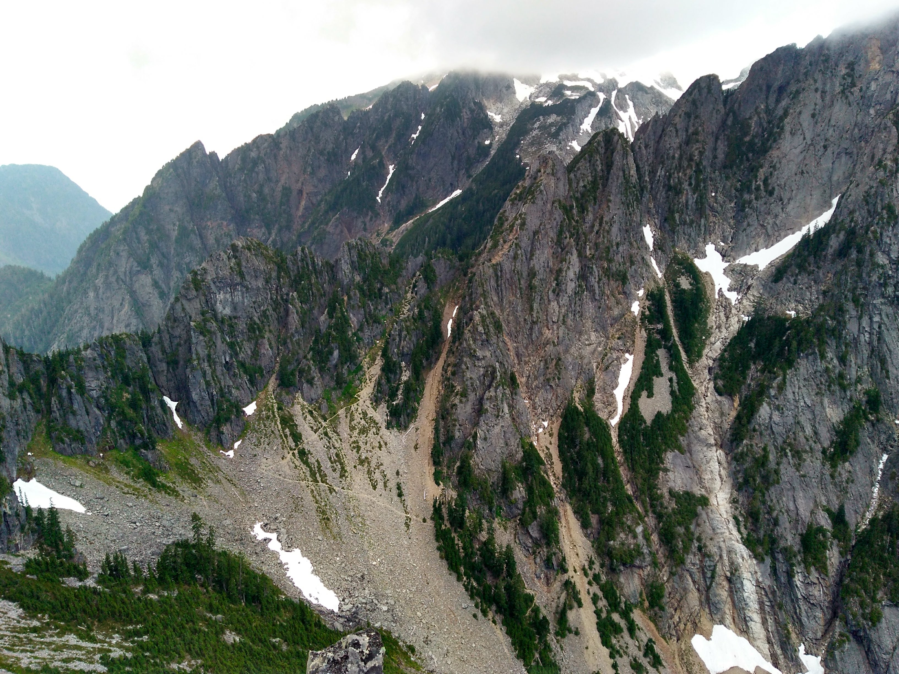
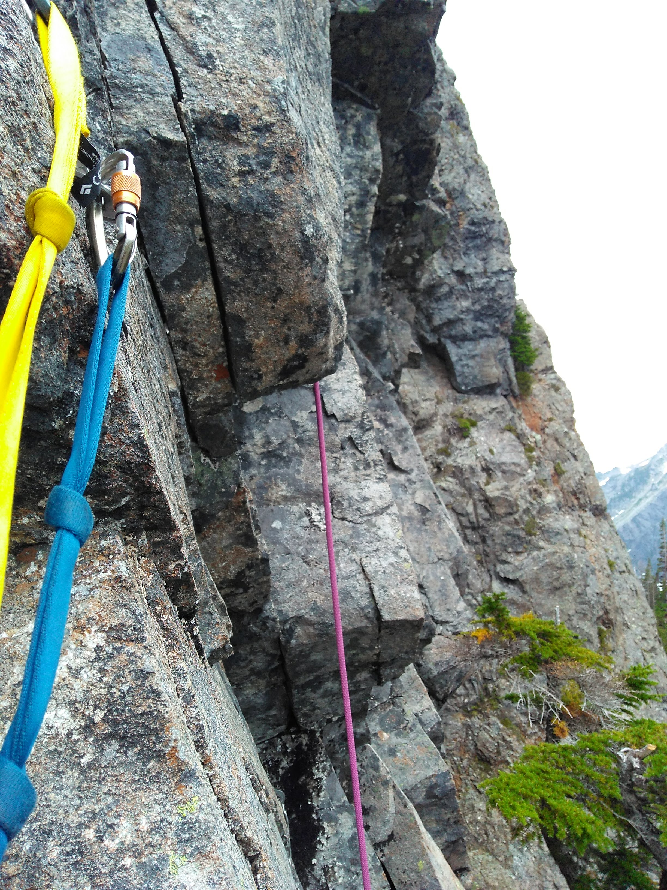

# Mile High Club

A climb I discovered on [Mountain
Project](https://www.mountainproject.com/route/112553808/mile-high-club) to do
while I was in the area on a camping trip.

We started the day a bit after 8, taking a quick sub-30 minute drive to get to
the trailhead from our camp site.  The road down to the Sunrise Mine trailhead
was a bit rough in places, with at least a single large washout that I was
impressed our large van could handle - the clearance was better that I thought!
Our hike down the trailhead started around 8:30/45, after a quick banana/peanut
butter breakfast.

The hike in was really pretty, with 3-4 stream/river crossings and some amazing
mountain views as the trees thinned.  Pardon the mediocre image quality : ).

*Matthew on the trail*

Eventually the trail turned into a treeless alpine meadow...

...and then into a talus field.  The transition was marked by this cute
campsite.  

A short ways up we saw this ice cave, reminiscent of the Big Four Ice caves we
visited the previous day:

On the talus, the trail became hard to follow, and we lost it on our way up.
We knew we had to leave the trail at some point, but were not sure which
direction (should have brought a map...).  Luckily we eventually found this
trail marker, which marked our fork left, with the pass trail going right.

Embarrassingly, it took us a bit to disambiguate which of the peaks we were
actually planning to climb...

...but we found it eventually!

As we closed in on the peak the Mountain Project description for how to
approach got a lot clearer, as did the pass tail with its many switchbacks.

This reddish colored rock with a slight trickle of water marked the end of our
hike and the start of our climb.  We stopped here briefly for our last
banana+bread wraps, left our bag on a ledge, and continued up!  Our climb
started at around noon; we lost some time on the approach pathfinding.

The climb up was very easy to track both by scanning for the bright, new bolts
and referencing the Mountain Project description.  The first pitch had a very
obvious start, with three close bolts through a slightly overhanging juggy
start.  It was a bit intimidating as a first lead, but quickly confidence
boosting as I realized the moves were actually quite natural.

*Looking down from the first belay.*

The second pitch was more relaxed, and the third, long, pitch had a couple
sections of hiking-with-a-rope.  The views were beautiful the whole way.

*Matthew starting up pitch 4 or 5.*

*The summit!?*

