# Family History

```mermaid
---
title: Family Tree
---
%%{
  init: {
    'theme': 'base',
    'themeVariables': {
      'background': '#f4f4f4',
      'edgeLabelBackground': '#f4f4f4',
      'secondaryColor': '#f4f4f4'
    }
  }
}%%
flowchart BT;

  %% Types of nodes with distinctive styles
  classDef person fill:#bbf,stroke-width:4px
  classDef union fill:#f9f

  subgraph mother
  %% m-school["Went to school"]
  end
  %% style mother fill:#bbf
  class mother person
  class m-school person
  mother-->mf-married

  subgraph father
  end
  father-->mf-married

  mf-married["Married"]

  %% Pranute Branch %%

  mf-married-->pranute
  subgraph pranute["Pranute"]
  end

  pranute-->aidas
  subgraph aidas["Aidas"]
  end

  pranute-->daina
  subgraph daina["Daina"]
  end
  daina-->daina-aloyzas-married

  subgraph aloyzas["Aloyzas"]
  end
  aloyzas-->daina-aloyzas-married

  daina-aloyzas-married["Married"]

  daina-aloyzas-married-->marius
  subgraph marius["Marius"]
  end

  daina-aloyzas-married-->vilija
  subgraph vilija["Vilija"]
  end

  daina-aloyzas-married-->svaja
  subgraph svaja["Svaja"]
  end

  %% Zuzana Branch %%

  mf-married-->|1900|zuzana
  subgraph zuzana["Zuzana Alexandraviciute"]
  born-->schooled
  end

  subgraph petras["Petras Pupius"]
  bornn-->schooledd
  end

  zuzana-->zuzana-petras-married
  petras-->zuzana-petras-married
  subgraph zuzana-petras-married
  married-->moved-->did-x
  end

  zuzana-petras-married-->antanas
  subgraph antanas["Antanas"]
  end

  subgraph nijole["Nijole (Mamulyte)"]
  end

  nijole-->antanas-nijole-married
  antanas-->antanas-nijole-married
  subgraph antanas-nijole-married["Married"]
      direction LR
      nijole-austria["Lived in Austrian Barn"]
      nijole-austria-->nijole-us
      nijole-us["Travelled to US"]
  end

  subgraph rim["Rimvydas"]
  end
  rim--->|Invited| palunas-seattle 

  antanas-nijole-married-->|October 11, 1962; Chicago|neris
  subgraph neris["🌊 Neris"]
  direction BT
  neris-li["1980: Masters Lithuanian Studies"]-->neris-bs["1985: Pharmacy BS, U Illinois"]-->neris-pharmd["2003: Pharm-D, U Washington"]-->neris-geriatric["2005: BCGP, U Washington"]
  end

  subgraph andy["`**Andy**
  Structural Engineer
  Skiier, Guitarist
  Introverted
  `"]
  end

  neris-->neris-andy-married
  andy-->neris-andy-married
  subgraph neris-andy-married
  palunas-seattle["Moved to Seattle"]
  end

  neris-->laura-neris-married
  laura-->laura-neris-married
  subgraph laura-neris-married
  orcas-move["Moved to Orcas 🐋"]
  end

  neris-andy-married-->|September 14, 1993; Seattle|kovas
  kovas["`<a href='/docs/about-me/'>🐦 Kovas</a>
  Programmer, Bio Data Analyst
  Rock Climber, Gamer
  kovasap.github.io
  `"]@{ shape: braces }
  kovas-->kovas-claire-married

  subgraph claire["🌤️ Claire"]
  end
  claire-->kovas-claire-married

  kovas-claire-married["Married"]

  neris-andy-married-->vaiva
  subgraph vaiva["🐴 Vaiva 🌈"]
  end

```

## Ideas for Improvement

 - Make subgraphs collapsible when https://github.com/mermaid-js/mermaid/issues/5508 is done
 - Make it so that each node's X position maps to the year it occurred, making the chart also effectively a timeline.
 - Fiddle with subgraph shapes once https://github.com/mermaid-js/mermaid/issues/2752 is done

Categories: [History](?History=true)
