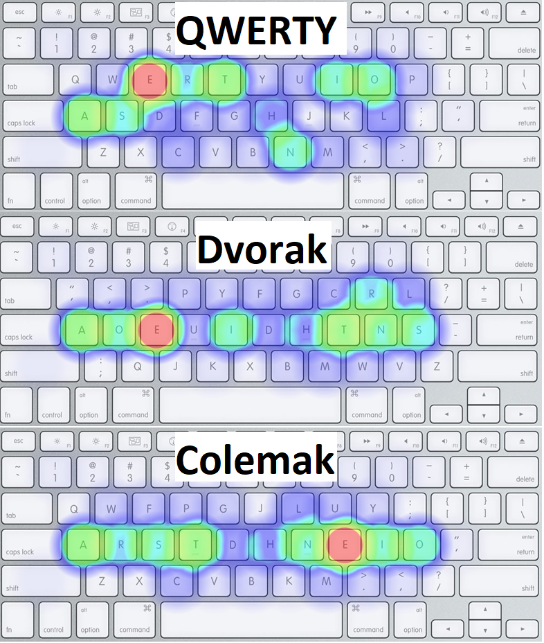

# Keyboard Layouts

https://www.keybr.com/layouts

https://www.reddit.com/r/Colemak/comments/qslro8/10000_simple_wikipedia_sentences_heatmap_qwerty/

## Touch Typing

I find this "finger-key ownership" scheme to be the most comfortable, at least when using the Colemak layout:

## Speed Testing

https://monkeytype.com/ with tags is a good way to compare typing speed.

Categories: [Lifestyle Optimizations](?Lifestyle-Optimizations=true)
